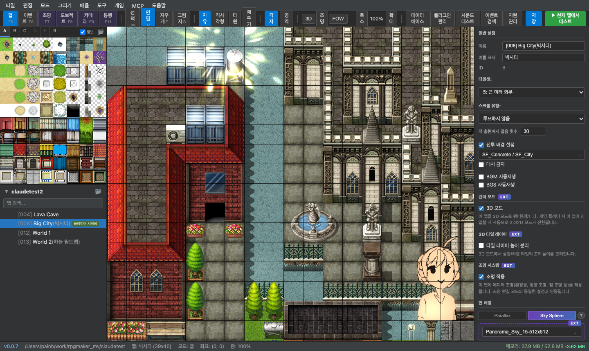
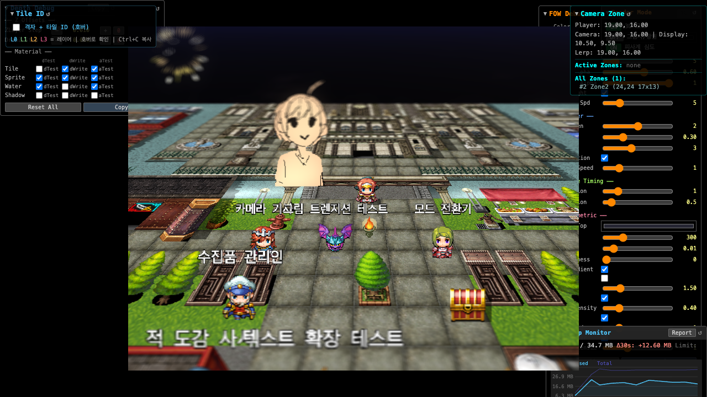

# RPG Maker MV Editor

[日本語](README.ja.md) | [한국어](README.md)

| **[Editor Demo](https://rpgmakerdemo.gosuni.com/)** (read-only) | **[Demo Project](https://rpgmaker-mv-claudetest.pages.dev/)** |
|---|---|
| [](https://rpgmakerdemo.gosuni.com/) | [](https://rpgmaker-mv-claudetest.pages.dev/) |

A desktop editor for editing RPG Maker MV projects in a web browser.

## Download

**[Latest Release](https://github.com/gosuni2025/rpgmaker-mv-editor/releases/latest)**

| Platform | File |
|---|---|
| macOS Apple Silicon | `*-mac-arm64.dmg` |
| macOS Intel | `*-mac-x64.dmg` |
| Windows | `*-win.zip` |

## Prerequisites

- **RPG Maker MV** is required. This editor edits RPG Maker MV project files and depends on its runtime assets.

## Documentation

- [Editor Overview & UI Layout](docs/01-overview.md)
- [Map Editor](docs/02-map-editor.md) — Tile editing, lighting, objects, fog
- [3D Mode](docs/03-3d-mode.md) — Camera controls, rendering, skybox
- [UI Editor](docs/04-ui-editor.md) — Skin system, custom scenes
- [Plugin List](docs/05-plugins.md) — Documentation for 14 bundled plugins
- [Event Editor](docs/06-event-editor.md) — Command editing, scripts, move routes, conditional branches

## AI Integration (MCP)

The editor has a built-in MCP (Model Context Protocol) server that allows Claude to directly operate the editor. You can request map creation, event writing, database editing, and more in natural language.

**Setup guide**: [docs/mcp-setup.md](docs/mcp-setup.md)

## Development

### Requirements

- Node.js 20+
- npm

### Install & Run

```bash
# Install dependencies (root only — client/server installed automatically)
npm install

# Run in development mode (server:3001 + client:5173, MCP:3002)
npm run dev
```

### Build

```bash
# Full build (client + server + Electron)
npm run build

# Package desktop app
npm run dist
```

## Architecture

- **Client**: React 18 + TypeScript + Vite + Zustand
- **Server**: Express + TypeScript
- **Rendering**: Three.js + RPG Maker MV runtime (uses Spriteset_Map directly for map rendering identical to the actual game)
- **Desktop**: Electron (bundles client + server into a single app)
- **AI Integration**: Built-in MCP (Model Context Protocol) SSE server (port 3002)

## License

[MIT](LICENSE)
