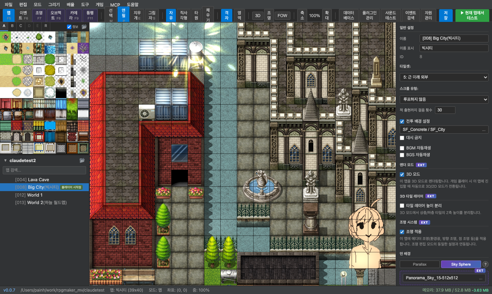
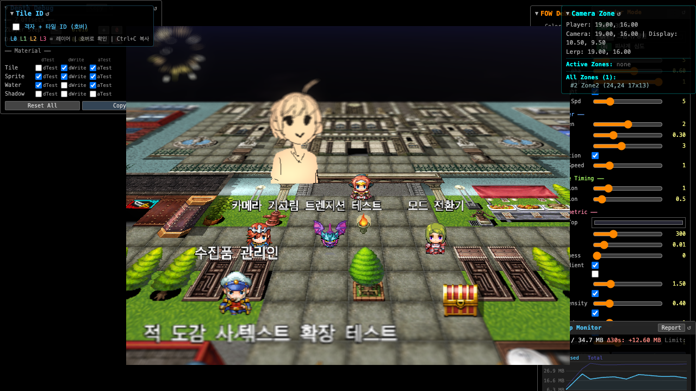

# RPG Maker MV Editor

| **[에디터 데모 페이지](https://rpgmakerdemo.gosuni.com/)** (저장 안됨) | **[데모 프로젝트](https://rpgmaker-mv-claudetest.netlify.app/)** |
|---|---|
| [](https://rpgmakerdemo.gosuni.com/) | [](https://rpgmaker-mv-claudetest.netlify.app/) |

RPG Maker MV 프로젝트를 웹 브라우저에서 편집할 수 있는 데스크톱 에디터입니다.

## 다운로드

**[최신 릴리즈](https://github.com/gosuni2025/rpgmaker-mv-editor/releases/latest)**

| 플랫폼 | 파일 |
|---|---|
| macOS Apple Silicon | `*-mac-arm64.dmg` |
| macOS Intel | `*-mac-x64.dmg` |
| Windows | `*-win.zip` |

## 사전 요구사항

- **RPG Maker MV**가 필요합니다. 이 에디터는 RPG Maker MV 프로젝트 파일을 편집하며, 런타임 에셋에 의존합니다.

## 주요 기능

### 맵 편집
- 타일 그리기: 연필, 직사각형, 타원, 채우기 도구
- 섀도우(그림자) 레이어 편집
- 줌 레벨 및 스크롤 위치 맵별 저장/복원

### 이벤트 편집
- 이벤트 생성 / 편집 / 삭제
- 이벤트 커맨드 전체 지원 (메시지, 흐름제어, 파티, 액터, 이동, 화면, 오디오, 씬, 전투 등)
- 전체 맵 이벤트 검색

### 데이터베이스 편집
액터, 직업, 스킬, 아이템, 무기, 방어구, 적, 적 그룹, 스테이트, 애니메이션, 타일셋, 커먼 이벤트, 시스템/타입/용어 설정

### 3D 모드
- Mode3D / ShadowAndLight / DepthOfField 플러그인 기반 실시간 렌더링
- 조명 배치 및 설정 (ShadowAndLight 플러그인 연동)
- 이미지 오브젝트 배치 / 변환
- 카메라 영역(Camera Zone) 설정

### 기타
- **플레이테스트**: 에디터에서 바로 게임 실행
- **플러그인 매니저**: 플러그인 활성화/비활성화
- **리소스 매니저**: 이미지·오디오 파일 관리
- **사운드 테스트**: BGM/BGS/ME/SE 미리듣기
- **캐릭터 생성기**: 캐릭터 스프라이트 생성

## AI 연동 (MCP)

에디터는 **MCP(Model Context Protocol)** 서버를 내장하고 있어 Claude가 에디터를 직접 조작할 수 있습니다.

MCP를 연결하면 Claude에게 자연어로 요청하는 것만으로:
- 맵 생성 및 이벤트 배치
- NPC 대화 / 조건 분기 이벤트 작성
- 데이터베이스(액터·스킬·아이템 등) 편집
- 이미지·오디오·영상 리소스 목록 조회

등의 작업을 자동으로 수행합니다.

**설정 방법**: [docs/mcp-setup.md](docs/mcp-setup.md) 참조

에디터는 프로젝트 `data/` 디렉터리의 파일 변경도 WebSocket으로 감시하며, AI(또는 외부 프로세스)가 JSON 파일을 수정하면 에디터가 자동으로 실시간 리로드합니다.

## 개발

### 요구사항

- Node.js 20+
- npm

### 설치 및 실행

```bash
# 의존성 설치 (루트 한 번만 — client/server 자동 설치됨)
npm install

# 개발 모드 실행 (서버:3001 + 클라이언트:5173, MCP:3002)
npm run dev
```

### 빌드

```bash
# 전체 빌드 (클라이언트 + 서버 + Electron)
npm run build

# 데스크톱 앱 패키징
npm run dist
```

## 아키텍처

- **클라이언트**: React 18 + TypeScript + Vite + Zustand
- **서버**: Express + TypeScript
- **렌더링**: Three.js + RPG Maker MV 런타임 (Spriteset_Map을 직접 사용하여 실제 게임과 동일한 맵 렌더링)
- **데스크톱**: Electron (클라이언트 + 서버를 하나의 앱으로 번들링)
- **AI 연동**: MCP(Model Context Protocol) SSE 서버 내장 (포트 3002)

## 라이선스

[MIT](LICENSE)
