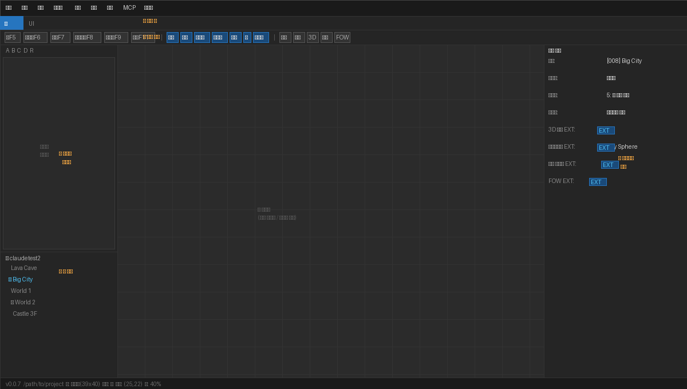

# 에디터 개요

## 화면 구성



에디터는 5개 영역으로 구성됩니다.

| 영역 | 설명 |
|------|------|
| ① **메뉴바** | 파일, 편집, 모드, 그리기, 배율, 도구, 게임, MCP, 도움말 |
| ② **탭 바** | **맵** 편집 탭 / **UI** 편집 탭 전환 |
| ③ **도구 모음** | 편집 모드 · 그리기 도구 · 3D/FOW 토글 · 데이터베이스 버튼 |
| ④ **사이드바** | 타일셋 팔레트 (상단) + 맵 트리 (하단) |
| ⑤ **맵 캔버스** | 타일 그리기 / 이벤트 편집 영역 |
| ⑥ **인스펙터** | 선택된 맵·이벤트·오브젝트의 속성 편집 |

---

## 메뉴바

### 파일
| 항목 | 단축키 | 설명 |
|------|--------|------|
| 프로젝트 열기 | — | RPG Maker MV 프로젝트 폴더 선택 |
| 저장 | `Ctrl+S` | 현재 맵 저장 |
| 새 프로젝트 | — | 프로젝트 새로 생성 |
| 배포 | — | 배포 패키지 생성 (GitHub Pages 포함) |

### 편집
| 항목 | 단축키 | 설명 |
|------|--------|------|
| 실행 취소 | `Ctrl+Z` | 마지막 작업 취소 |
| 다시 실행 | `Ctrl+Y` | 취소한 작업 재실행 |
| 잘라내기 | `Ctrl+X` | 선택 영역 잘라내기 |
| 복사 | `Ctrl+C` | 선택 영역 복사 |
| 붙여넣기 | `Ctrl+V` | 클립보드 붙여넣기 |
| 찾기 | `Ctrl+F` | 이벤트 검색 |

### 도구
| 항목 | 설명 |
|------|------|
| 데이터베이스 | 액터/스킬/아이템 등 DB 편집 |
| 플러그인 관리자 | 플러그인 활성화/비활성화/순서 조정 |
| 사운드 테스트 | BGM/SE 재생 테스트 |
| 리소스 관리자 | 이미지/오디오 파일 관리 |
| 이벤트 검색 | 커맨드/텍스트로 이벤트 검색 |

### 게임
| 항목 | 단축키 | 설명 |
|------|--------|------|
| 플레이테스트 | — | 현재 맵에서 게임 실행 |
| 현재 맵에서 테스트 | 우측 상단 버튼 | 현재 맵 위치에서 바로 시작 |

### MCP
Claude AI와 연동하여 이벤트를 자동 생성하거나 수정하는 기능입니다. MCP 서버가 실행 중일 때 활성화됩니다.

---

## 도구 모음

```
[맵F5] [이벤트F6] [조명F7] [오브젝트F8] [카메라F9] [통행F11]
│     선택M  연필P  지우개E  채우기  직사각형  타원  체우기     │
│     격자  영역  3D  조명  FOW  축소  40%  확대              │
```

### 편집 모드 (왼쪽 버튼 그룹)

| 버튼 | 단축키 | 설명 |
|------|--------|------|
| 맵 | `F5` | 타일 그리기 모드 |
| 이벤트 | `F6` | 이벤트 배치/편집 모드 |
| 조명 | `F7` | 조명 마커 배치 모드 (EXT) |
| 오브젝트 | `F8` | 이미지/타일 오브젝트 배치 모드 (EXT) |
| 카메라 | `F9` | 카메라 존 편집 모드 (EXT) |
| 통행 | `F11` | 타일 통행성 편집 모드 |

### 그리기 도구

| 도구 | 단축키 | 설명 |
|------|--------|------|
| 선택 | `M` | 영역 선택 (복사/이동) |
| 연필 | `P` | 한 타일씩 그리기 |
| 지우개 | `E` | 타일 삭제 |
| 채우기 | — | 동일 타일을 모두 교체 |
| 직사각형 | — | 사각형 영역 그리기 |
| 타원 | — | 타원 영역 그리기 |
| 체우기 | — | 닫힌 영역 채우기 |

### 표시 옵션

| 버튼 | 설명 |
|------|------|
| 격자 | 타일 격자선 표시/숨김 |
| 영역 | 리전 레이어(z=5) 표시/숨김 |
| **3D** | 3D 렌더링 모드 토글 **(EXT)** |
| 조명 | 조명 마커 표시/숨김 |
| **FOW** | 안개 효과 (Fog of War) 설정 **(EXT)** |
| 축소/확대 | 캔버스 줌 조절 |

---

## 인스펙터 패널

오른쪽 인스펙터는 현재 맵의 속성을 표시합니다.

### 일반 설정
- **이름** / **표시명** — 맵 파일명과 게임 내 표시 이름
- **타일셋** — 사용할 타일셋 선택
- **스크롤 유형** — 루프 없음 / 가로 루프 / 세로 루프 / 양방향 루프
- **전투 배경 설정** — 배경1/배경2 이미지
- **BGM/BGS 자동재생**

### 확장 설정 (EXT)

> `EXT` 뱃지가 있는 항목은 원본 RPG Maker MV와의 호환을 위해 `Map*_ext.json`에 별도 저장됩니다.

| 항목 | 설명 |
|------|------|
| **3D 모드** | 이 맵을 3D 모드로 플레이 |
| **3D 타일 레이어** | 3D에서 상층 타일을 높이로 표현 |
| **조명 시스템** | 조명 효과 활성화 |
| **면 배경** | Parallax(2D 배경) 또는 Sky Sphere(3D 스카이박스) |
| **애니메이션 타일 에디터** | 물/폭포 타일의 애니메이션 속도 조절 |

---

## 상태바

화면 하단에 현재 상태를 표시합니다.

```
v0.0.7  /path/to/project  맵: Big City(39x40)  모드: 맵  좌표: (25, 22)  줌: 40%
```

---

## 단축키 목록

| 키 | 기능 |
|----|------|
| `Ctrl+S` | 저장 |
| `Ctrl+Z` / `Ctrl+Y` | 실행 취소 / 다시 실행 |
| `F5`~`F9`, `F11` | 편집 모드 전환 |
| `M` / `P` / `E` | 선택 / 연필 / 지우개 |
| `+` / `-` | 줌 인 / 줌 아웃 |
| `마우스 휠` | 줌 조절 |
| `우클릭` 드래그 | 맵 캔버스 이동 |
| `이벤트 더블클릭` | 이벤트 편집기 열기 |
