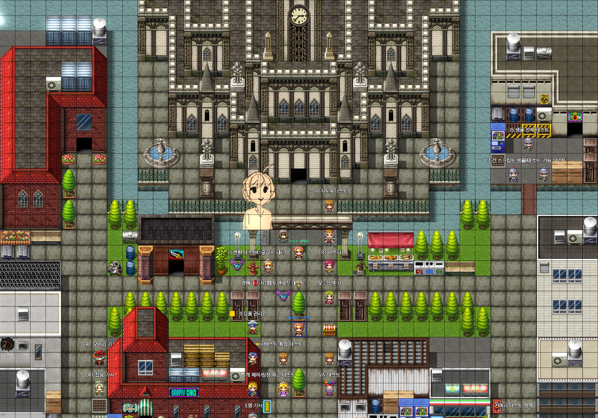
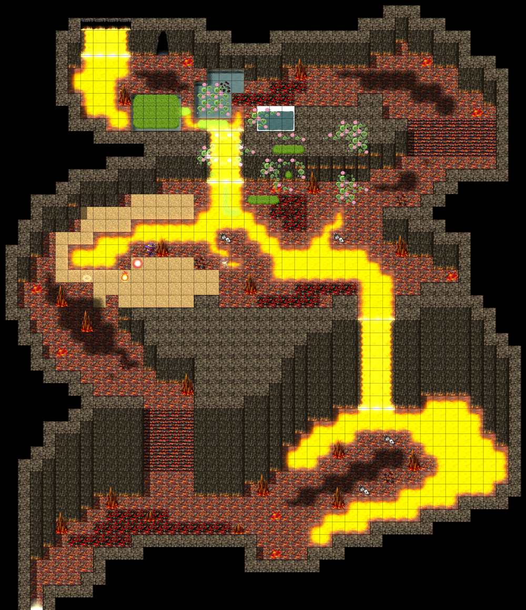
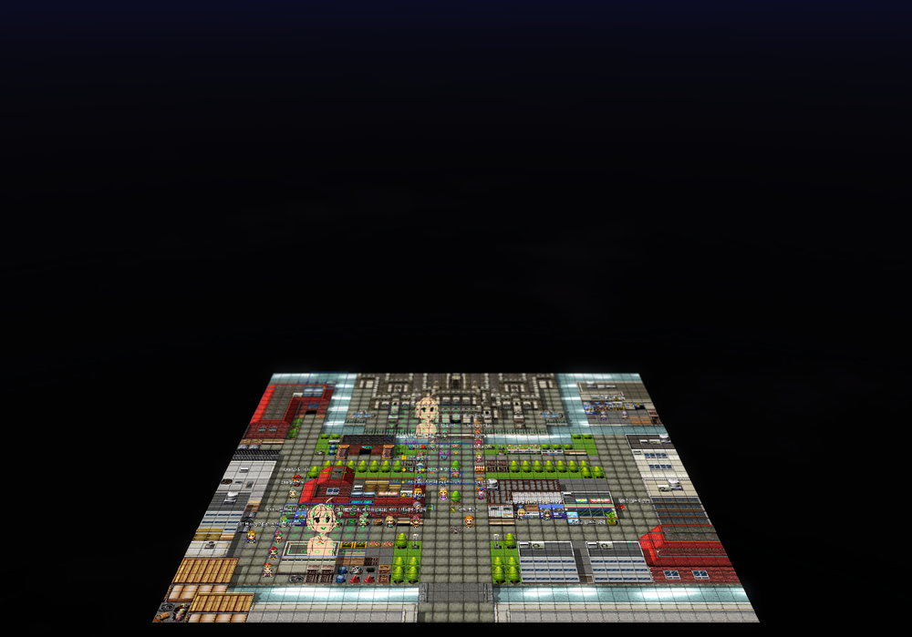

# 맵 에디터

## 맵 캔버스



맵 캔버스는 에디터의 중심입니다. 타일 팔레트에서 선택한 타일을 캔버스에 그리거나, 이벤트를 배치하고 편집할 수 있습니다.

---

## 사이드바

### 타일셋 팔레트

사이드바 상단에는 타일셋 팔레트가 있습니다.

**탭 구성**:
- `A` — A1~A5 오토타일 (물, 지형, 건물 외벽, 벽)
- `B` — B 타일셋
- `C` — C 타일셋
- `D` — D 타일셋
- `R` — 리전 레이어 (Region ID 1~255)

팔레트에서 타일을 클릭하면 선택되며, 드래그하면 여러 타일을 한 번에 선택할 수 있습니다.

### 맵 트리

사이드바 하단에는 맵 트리가 있습니다.
- 맵을 **더블클릭**하면 해당 맵이 열립니다.
- 맵을 **우클릭**하면 새 맵 추가/삭제/속성 편집 메뉴가 나타납니다.
- 맵을 드래그하여 계층 구조를 변경할 수 있습니다.

---

## 편집 모드

### 맵 편집 모드 (`F5`)

타일을 그리는 모드입니다. 상단 도구 모음에서 그리기 도구를 선택합니다.

**레이어 선택**:
```
[A] [B] [C] [D] [R]      ← 타일셋 팔레트 탭
[A] [B] [C]              ← 레이어 표시 토글 (A: 오토타일, B: 기타)
```

**그리기 도구**:

| 도구 | 동작 |
|------|------|
| 연필 (P) | 클릭/드래그로 한 타일씩 그리기 |
| 선택 (M) | 드래그로 영역 선택 → 복사(Ctrl+C)/이동 가능 |
| 지우개 (E) | 클릭/드래그로 타일 삭제 |
| 채우기 | 동일 타일을 클릭한 위치부터 모두 교체 |
| 직사각형 | 드래그로 사각형 영역 그리기 |
| 타원 | 드래그로 타원 영역 그리기 |
| 체우기 | 닫힌 영역 내부를 채우기 |

**타일 정보 툴팁**: 마우스를 맵 위에 올리면 해당 타일의 레이어별 정보가 표시됩니다.

### 이벤트 편집 모드 (`F6`)

이벤트를 배치하고 편집하는 모드입니다.

- **빈 타일 더블클릭** — 새 이벤트 생성
- **이벤트 더블클릭** — 이벤트 편집기 열기
- **이벤트 우클릭** — 복사/붙여넣기/삭제 메뉴
- **이벤트 드래그** — 위치 이동

이벤트 위에는 이벤트 ID와 캐릭터 스프라이트(있는 경우)가 표시됩니다.

### 통행성 편집 모드 (`F11`)

타일별 통행성(이동 가능 여부)을 편집합니다.

- ○ — 통행 가능
- × — 통행 불가
- ↑↓←→ — 방향별 통행성

---

## 조명 시스템 (EXT)

> 맵 인스펙터에서 **조명 시스템** 체크박스를 활성화해야 합니다.

### 조명 모드 (`F7`)

조명 마커를 맵에 배치하고 편집합니다.

**조명 종류**:
- **포인트 라이트** — 특정 위치에서 사방으로 빛을 발산
- **앰비언트 라이트** — 맵 전체 기본 밝기
- **스팟 라이트** — 방향이 있는 조명

**조명 마커**: 편집 모드에서 빛 모양의 마커로 표시됩니다.

**인스펙터에서 편집**:
- 색상 (RGB)
- 강도 (Intensity)
- 반경 (Range)
- 감쇠 방식

Lava Cave 예시 — 조명 효과:



---

## 오브젝트 시스템 (EXT)



맵에 이미지/타일 오브젝트를 자유롭게 배치하는 시스템입니다.

### 오브젝트 모드 (`F8`)

왼쪽 오브젝트 목록에서 오브젝트를 선택하거나 새로 생성할 수 있습니다.

**오브젝트 종류**:
- **타일 오브젝트** — 타일셋에서 선택한 타일을 배치 (정수 배율 크기)
- **외곽선 오브젝트** — 맵에서 타일 영역을 범위로 지정
- **이미지 오브젝트** — 이미지 파일을 직접 배치 (임의 크기/위치)
- **애니메이션 오브젝트** — 데이터베이스 애니메이션을 재생

**오브젝트 속성** (인스펙터):
- 위치 (X, Y, Z)
- 크기 (가로 폭 N타일)
- 높이(Z축) 오프셋
- 렌더 레이어 순서

---

## 카메라 존 (EXT)

카메라 존을 사용하면 특정 맵 영역에 진입할 때 카메라 위치·각도가 자동으로 변경됩니다.

### 카메라 모드 (`F9`)

- 캔버스에서 드래그하여 카메라 존 영역 생성
- 영역 클릭으로 선택 후 인스펙터에서 설정 편집

**카메라 존 설정**:
- **타겟 위치** — 카메라가 바라볼 중심점
- **카메라 오프셋** — 카메라 위치 조정
- **줌** — 줌 배율
- **이징** — 전환 애니메이션 방식

---

## FOW (Fog of War) (EXT)

도구 모음의 **FOW** 버튼으로 안개 효과를 설정합니다.

**FOW 설정** (인스펙터):
- **활성화** — FOW 켜기/끄기
- **시야 반경** — 탐색 가능 범위 (타일 단위)
- **안개 색상** — 미탐색 영역 색상
- **안개 불투명도**
- **에디터에서 보기** — 에디터 화면에서 FOW 미리보기

---

## 맵 속성 편집

맵 트리에서 맵을 **우클릭 → 속성** 또는 맵을 열고 인스펙터에서 직접 편집합니다.

**설정 가능 항목**:
- 이름 / 표시명
- 맵 크기 (가로 × 세로 타일 수)
- 타일셋
- 스크롤 유형 (루프 여부)
- 전투 배경
- BGM/BGS 자동재생
- **3D 모드** (EXT)
- **스카이박스** (EXT)
- **조명 시스템** (EXT)
- **FOW** (EXT)
- 메모 (노트)

---

## 애니메이션 타일 에디터 (EXT)

인스펙터 하단의 **애니메이션 타일 에디터** 섹션에서 물/폭포 오토타일의 애니메이션 설정을 조정합니다.

- **Water A (Meadow)** — 들판 물 애니메이션
- **Water B (Snow)** — 눈 위 물 애니메이션
- **Waterfall** — 폭포 애니메이션
- **Canal** — 수로 애니메이션

각 타일의 **속도** (프레임/틱)와 **셰이더 적용** 여부를 설정합니다.
