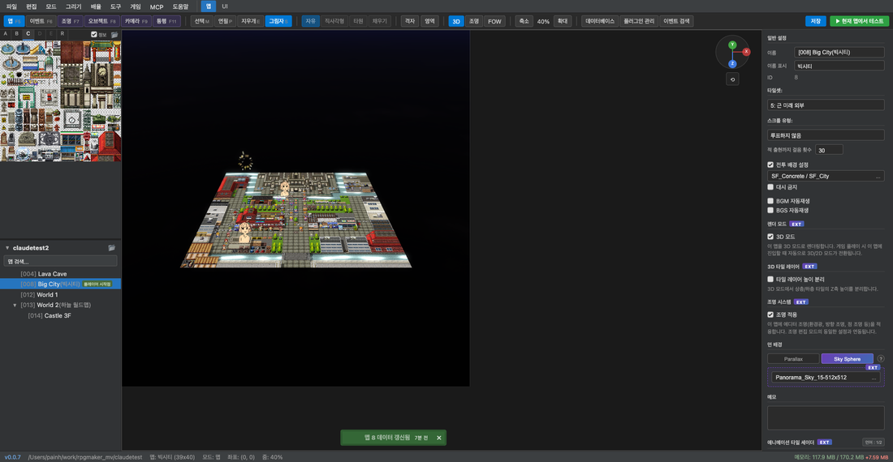

# 3D 모드

## 개요

3D 모드는 RPG Maker MV의 2D 맵을 **HD-2D 스타일의 원근 뷰**로 렌더링하는 기능입니다.
Three.js WebGL 렌더러를 사용하며, 기존 RPG Maker MV의 타일/캐릭터 스프라이트를 3D 공간에서 렌더링합니다.

---

## 활성화 방법

### 에디터에서 3D 뷰 보기

도구 모음의 **3D 버튼**을 클릭하면 에디터 캔버스가 3D 뷰로 전환됩니다.

### 게임에서 3D 모드 실행

맵 인스펙터에서 **3D 모드** 체크박스를 활성화하면, 해당 맵에서 게임 플레이 시 자동으로 3D 모드로 시작됩니다.

> 게임 내에서도 2D ↔ 3D 전환이 가능합니다. 이벤트 커맨드 또는 플러그인 커맨드를 통해 런타임 중 전환할 수 있습니다.

---

## 3D 카메라 조작

### 에디터에서

3D 모드 활성화 시 맵 캔버스 우측 상단에 **gizmo(축 표시기)**가 나타납니다.

| 조작 | 동작 |
|------|------|
| 마우스 드래그 | 카메라 회전 (yaw) |
| 마우스 휠 | 줌 인/아웃 |
| 우클릭 드래그 | 카메라 패닝 |

### 게임에서

[TouchCameraControl 플러그인](plugins/touch-camera.md)이 활성화된 경우:

| 조작 | 동작 |
|------|------|
| 터치/드래그 | 카메라 yaw 회전 |
| 두 손가락 핀치 | 줌 인/아웃 |
| 마우스 휠 | 줌 인/아웃 |

---

## 3D 렌더링 시스템

### HD-2D 빌보드 스프라이트

3D 모드에서 캐릭터와 이벤트는 **빌보드 스프라이트** 방식으로 렌더링됩니다. 카메라가 회전해도 스프라이트는 항상 카메라를 향하며, 카메라 방향에 따라 캐릭터 스프라이트의 방향(프레임)이 자동으로 보정됩니다.

### 타일 렌더링

- 타일맵은 Three.js의 `BufferGeometry` 기반으로 GPU에서 직접 렌더링
- 상층 타일(Upper layer, z=4)이 캐릭터(z=3)를 정상적으로 가림 (지붕 효과)
- `renderOrder`로 앞뒤 순서 결정

### 3D 타일 레이어 (EXT)

맵 인스펙터의 **3D 타일 레이어** 옵션을 활성화하면, 상층 타일의 Z축 높이가 반영되어 건물 지붕 등이 실제로 높아 보이는 효과를 연출합니다.

---

## 스카이박스

3D 모드에서는 맵 배경으로 **파노라마 스카이박스**를 설정할 수 있습니다.

### 설정 방법

맵 인스펙터 → **면 배경** 섹션:

1. **Sky Sphere** 버튼 클릭
2. 파노라마 이미지 파일 선택 (Equirectangular 파노라마 PNG)
3. `img/skybox/` 폴더에 이미지를 배치

지원되는 이미지 형식: `img/skybox/파일명.png`

자세한 내용은 [SkyBox 플러그인 문서](plugins/skybox.md)를 참조하세요.

---

## 조명 시스템

3D 모드에서는 동적 조명이 실시간으로 렌더링됩니다.

- 포인트 라이트 — 원형으로 퍼지는 빛
- 앰비언트 라이트 — 전체 밝기 조절
- 그림자 계산 — ShadowAndLight.js 플러그인 처리

Lava Cave 맵처럼 용암 지형에서는 주황/노란 포인트 라이트가 극적인 분위기를 연출합니다.

자세한 내용은 [맵 에디터 — 조명 시스템](02-map-editor.md#조명-시스템-ext)을 참조하세요.

---

## 기술 참고

### Three.js 렌더링 주의사항

3D 모드는 다음 특성을 가집니다:

- **depthTest 비활성화**: 모든 오브젝트가 `depthTest: false`로 설정되어 있어, position.z가 아닌 `renderOrder`로만 앞뒤 순서가 결정됩니다.
- **Y-flip 보정**: Mode3D의 projection matrix가 Y축을 반전(`m[5] = -m[5]`)하므로, 오버레이 오브젝트에는 CanvasTexture Y-flip 보정이 필요합니다.
- **카메라 yaw 정렬**: 3D 모드에서 `_sortChildren()`이 `depth = x*sin(yaw) + y*cos(yaw)` 공식으로 정렬하여 카메라 회전 시에도 올바른 앞뒤 순서를 유지합니다.

### 듀얼 런타임 구조

프로젝트 폴더에는 두 가지 런타임이 공존합니다:

| 파일 | 런타임 | 용도 |
|------|--------|------|
| `index.html` | PIXI.js | RPG Maker MV 원본 호환 |
| `index_3d.html` | Three.js | 에디터 3D 모드 / 플레이테스트 |

원본 RPG Maker MV 스팀판에서 열기/플레이테스트 시에는 `index.html`(PIXI)을 사용합니다.
