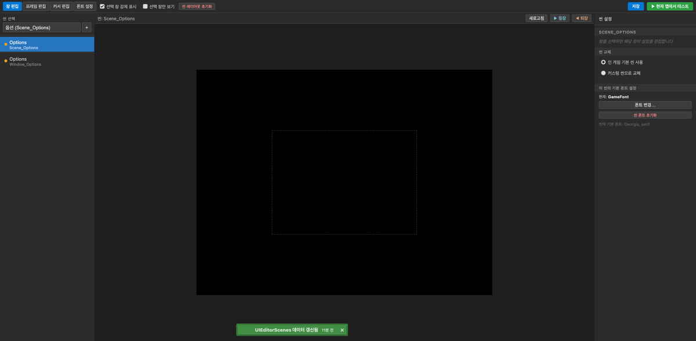
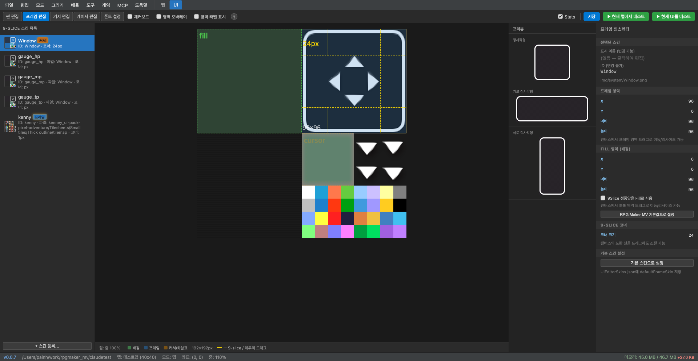

# UI 에디터

UI 에디터는 게임 내 UI를 시각적으로 편집하는 기능입니다.
상단 탭 바에서 **UI** 탭을 클릭하면 진입합니다.

UI 에디터는 두 가지 서브시스템으로 구성됩니다:

1. **UITheme** — 창 레이아웃 · 9-slice 스킨 · 폰트 커스터마이징
2. **커스텀 씬 엔진** — JSON으로 새로운 게임 내 UI 씬 정의

---

## UI 에디터 화면 구성



---

## UITheme — 창 스킨 시스템

`UITheme.js` 플러그인이 `data/UIEditorConfig.json`, `data/UIEditorSkins.json`, `data/UIEditorFonts.json`을 로드하여 게임 UI 전체를 커스터마이징합니다.

### 상 편집 탭

모든 게임 창(Window)의 기본 속성을 설정합니다.

**설정 가능 항목**:
- 기본 windowskin 이미지
- 기본 폰트 크기 / 색상 / 외곽선
- 배경 투명도 (backOpacity)
- 색조 (colorTone: R/G/B)

### 프레임 편집 탭

9-slice 스킨을 편집합니다. 창의 테두리/모서리/배경을 별도 이미지 영역으로 정의합니다.

**스킨 구조**:



**설정**:
- `fillX/Y/W/H` — 배경 채우기 소스 영역
- `frameX/Y/W/H` — 프레임 이미지 소스 영역
- `cornerSize` — 모서리 크기 (픽셀)

### 커서 편집 탭

선택 커서의 이미지와 애니메이션을 설정합니다.

### 폰트 설정 탭

폰트 프리셋을 정의합니다. 각 창에 다른 폰트를 적용할 수 있습니다.

- 폰트 파일: `fonts/` 폴더의 TTF/WOFF 파일
- 폰트 크기
- 외곽선 색상/두께
- 줄 높이

---

## 커스텀 씬 엔진

`CustomSceneEngine.js` 플러그인이 `data/UIScenes/_index.json` + 씬별 JSON 파일을 읽어 게임 내 UI 씬을 동적으로 생성합니다. (구 방식: `data/UIEditorScenes.json` — 폴백으로만 지원)

### 씬 선택 및 생성

좌측 상단의 **씬 선택 드롭다운**에서 편집할 씬을 선택합니다.

`+` 버튼으로 새 씬을 추가합니다.

### 씬 교체

인스펙터의 **씬 교체** 옵션:
- **인 게임 기본 씬 사용** — 원본 RPG Maker MV 씬 사용
- **커스텀 씬으로 교체** — `data/UIScenes/`에 정의된 씬으로 대체

예: `Scene_Options`를 커스텀 씬으로 교체하면, 게임 내 옵션 화면이 완전히 새로운 레이아웃으로 대체됩니다.

### 위젯 트리 (formatVersion 2)

커스텀 씬은 위젯 트리로 구성됩니다. 좌측의 씬 목록은 계층적 위젯 구조를 보여줍니다.

**위젯 종류**:

| 위젯 | 설명 |
|------|------|
| `Panel` | 레이아웃 컨테이너 (자식 위젯 배치) |
| `List` | 선택 가능한 명령 목록 |
| `Label` | 텍스트 표시 |
| `Image` | 이미지 표시 |
| `ActorFace` | 액터 얼굴 이미지 |
| `Gauge` | HP/MP/EXP 게이지 |
| `Button` | 클릭 가능한 버튼 |

### 템플릿 변수

텍스트에 `{변수}` 형식으로 동적 값을 삽입합니다:

```
{actor[0].name}    → 첫 번째 파티원 이름
{actor[0].level}   → 첫 번째 파티원 레벨
{actor[0].hp}      → 첫 번째 파티원 HP
{var:10}           → 게임 변수 #10 값
{switch:5}         → 게임 스위치 #5 상태 (true/false)
{gold}             → 파티 소유 골드
{config.bgmVolume} → 설정값 (bgmVolume)
```

### 실시간 테스트

**현재 맵에서 테스트** 버튼으로 현재 UI 설정을 게임에서 즉시 확인할 수 있습니다.

씬 편집 창 상단의 **등장** / **퇴장** 버튼으로 씬 전환 애니메이션을 미리 볼 수 있습니다.

---

## UIEditorConfig.json 구조

```json
{
  "windows": [
    {
      "windowClass": "Window_Options",
      "windowStyle": "frame",
      "windowskinName": "MyCustomSkin",
      "x": 100, "y": 50,
      "width": 400, "height": 300,
      "fontSize": 20,
      "backOpacity": 180,
      "colorTone": [0, 0, 30, 0]
    }
  ]
}
```

---

## UIEditorSkins.json 구조

```json
{
  "skins": [
    {
      "name": "MyCustomSkin",
      "windowskin": "Window_Blue",
      "fillArea": { "x": 0, "y": 0, "w": 64, "h": 64 },
      "frameInfo": { "x": 0, "y": 64, "w": 64, "h": 64, "cornerSize": 12 }
    }
  ]
}
```

---

## UIEditorFonts.json 구조

```json
{
  "fonts": [
    {
      "name": "GameFont",
      "face": "dotgothic16",
      "size": 22,
      "outlineColor": "rgba(0,0,0,0.7)",
      "outlineWidth": 3
    }
  ]
}
```
