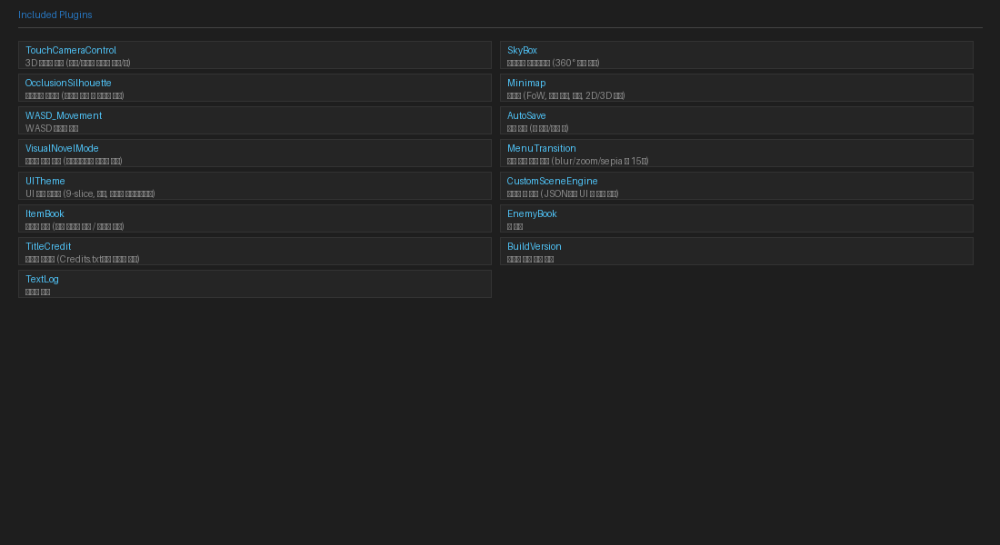

# 내장 플러그인 목록



에디터에 기본 포함된 플러그인 목록입니다.
프로젝트를 열면 `js/plugins/` 폴더에 자동으로 복사됩니다.

---

## 3D / 카메라

| 플러그인 | 요약 | 문서 |
|----------|------|------|
| **TouchCameraControl** | 터치/마우스로 3D 카메라 회전·줌 조작, HD-2D 캐릭터 방향 자동 보정 | [→](plugins/touch-camera.md) |
| **SkyBox** | Three.js 스카이 돔 — Equirectangular 파노라마 하늘 배경 | [→](plugins/skybox.md) |

## UI / 비주얼

| 플러그인 | 요약 | 문서 |
|----------|------|------|
| **UITheme** | 9-slice 스킨 · 폰트 · 창 레이아웃 전체 커스터마이징 (JSON 기반) | [→](plugins/ui-theme.md) |
| **CustomSceneEngine** | JSON으로 게임 내 UI 씬 동적 생성 | [→](plugins/custom-scene.md) |
| **MenuTransition** | 메뉴 열기/닫기 시 배경 blur/sepia/zoom 등 15가지 효과 | [→](plugins/menu-transition.md) |
| **VisualNovelMode** | 비주얼 노벨 스타일 타이프라이터 메시지 + 인라인 선택지 | [→](plugins/visual-novel-mode.md) |
| **OcclusionSilhouette** | 오브젝트 뒤에 숨은 캐릭터를 실루엣으로 표시 | [→](plugins/occlusion-silhouette.md) |

## HUD / 정보

| 플러그인 | 요약 | 문서 |
|----------|------|------|
| **Minimap** | FoW · 리전 색상 · 마커 지원 미니맵 (2D/3D) | [→](plugins/minimap.md) |
| **ItemBook** | 획득한 아이템/무기/방어구 도감 | [→](plugins/item-book.md) |
| **EnemyBook** | 조우한 적 도감 | [→](plugins/enemy-book.md) |
| **NPCNameDisplay** | NPC 머리 위 이름 표시 | — |
| **TextLog** | 메시지 대화 로그 열람 | [→](plugins/text-log.md) |

## 조작 / 시스템

| 플러그인 | 요약 | 문서 |
|----------|------|------|
| **WASD_Movement** | W/A/S/D 키를 방향키로, Q/E를 PageUp/Down으로 매핑 | [→](plugins/wasd-movement.md) |
| **AutoSave** | 맵 이동·전투 종료·메뉴 닫기 후 자동 저장 | [→](plugins/autosave.md) |
| **ShopStock** | 상점 재고 시스템 | — |
| **TouchDestAnimation** | 터치 이동 목적지 애니메이션 | — |

## 타이틀 / 기타

| 플러그인 | 요약 | 문서 |
|----------|------|------|
| **TitleCredit** | 타이틀 화면에 크레딧 버튼 추가 (Credits.txt 로드) | [→](plugins/title-credit.md) |
| **BuildVersion** | 타이틀 우하단에 빌드 번호 표시 | — |
| **MessageWindowCustom** | 메시지 창 커스터마이징 | — |

---

## 플러그인 관리

**도구 → 플러그인 관리자** 메뉴에서 플러그인을 관리합니다.

- 체크박스로 개별 플러그인 활성화/비활성화
- 드래그로 로드 순서 변경 (순서가 중요한 플러그인 있음)
- 플러그인 파라미터 설정

### 권장 로드 순서

3D 모드 사용 시 권장 순서:

```
1. UITheme
2. CustomSceneEngine
3. TouchCameraControl
4. SkyBox
5. OcclusionSilhouette
6. Minimap
7. AutoSave
8. VisualNovelMode
9. MenuTransition
10. WASD_Movement
... (기타 플러그인)
```
