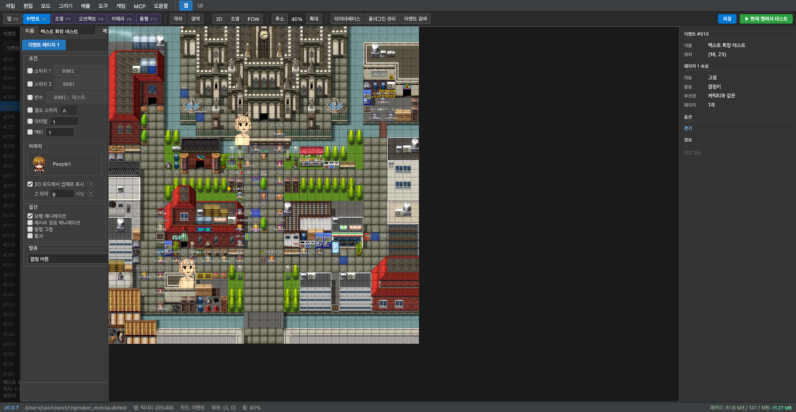
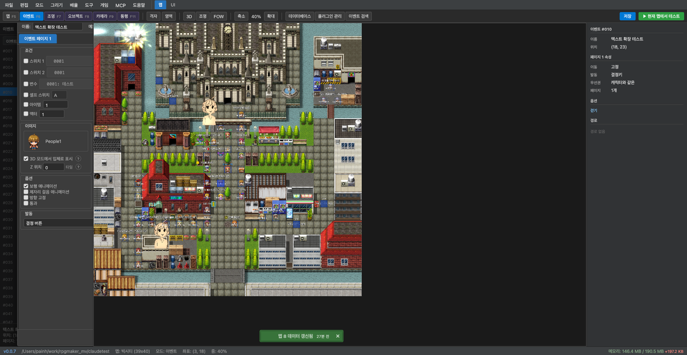
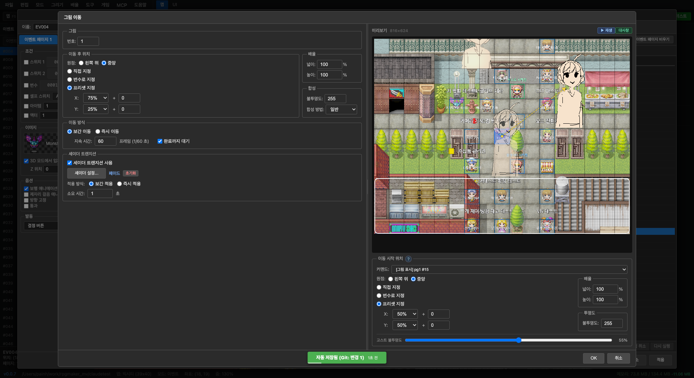
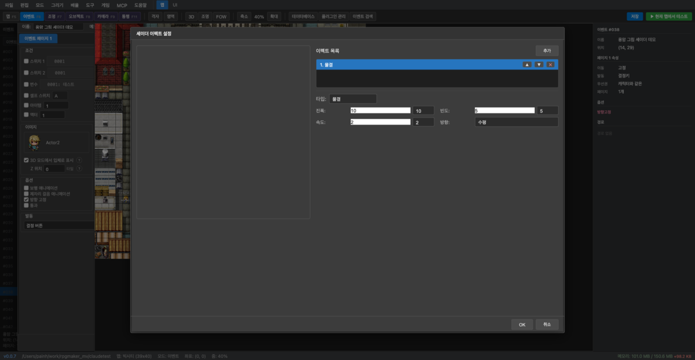
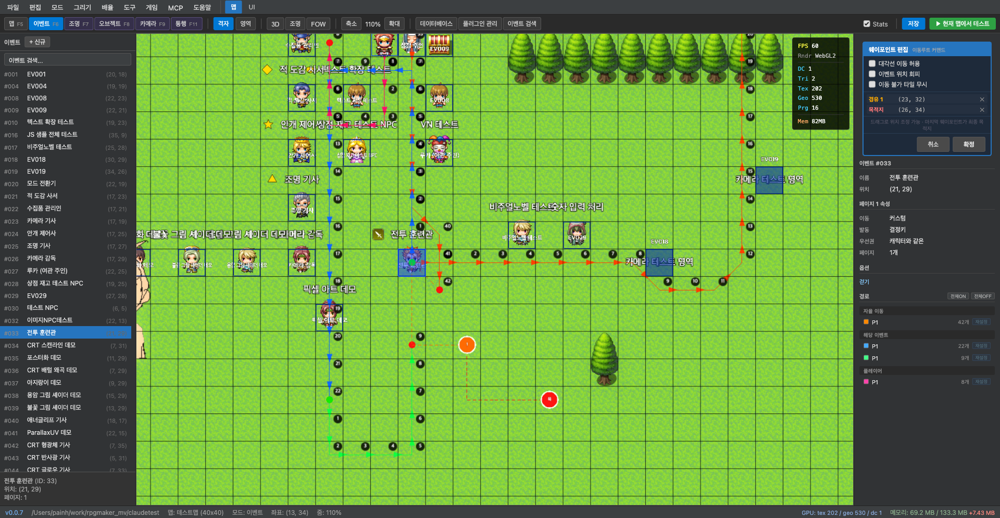
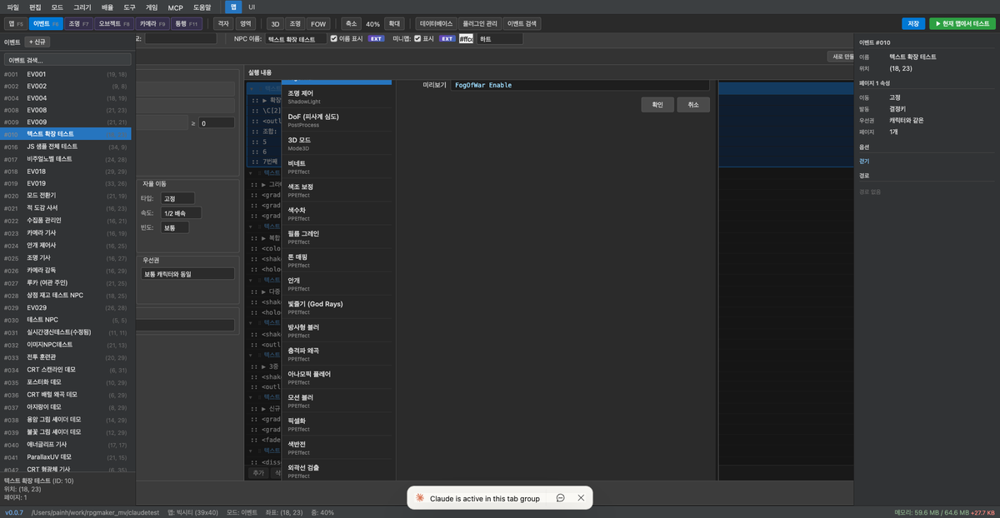
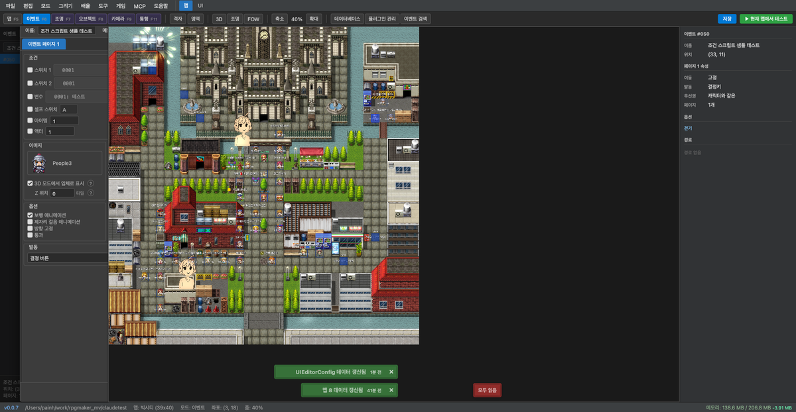
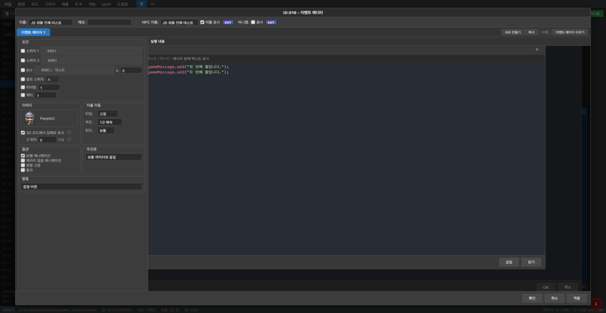
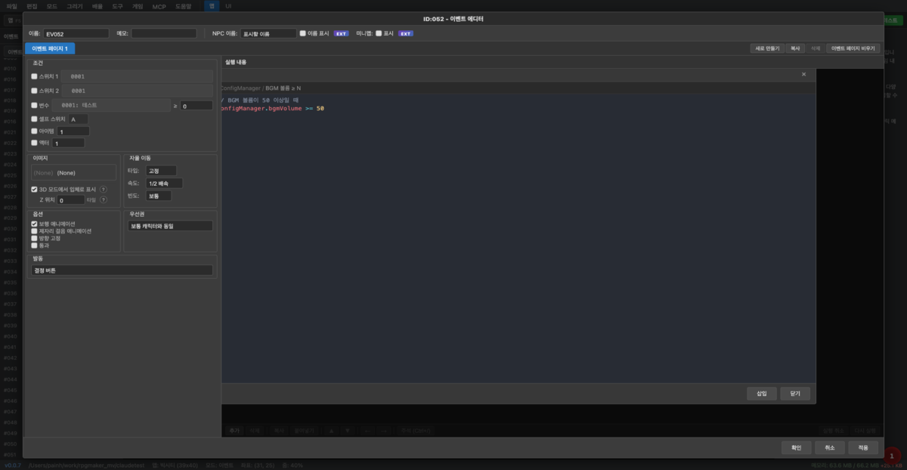

# 이벤트 에디터

이벤트 에디터는 맵에 배치된 이벤트의 조건, 실행 내용, 이미지, 이동 방식 등을 편집합니다.

## 화면 구성

- **왼쪽 패널**: 이벤트 이름, 메모, NPC 이미지, 이동 설정, 옵션, 발동 조건
- **오른쪽 패널**: 이벤트 페이지 목록 + 각 페이지의 실행 내용(커맨드 목록)

## 커맨드 삽입

실행 내용에서 **추가** 버튼을 누르면 커맨드 삽입 다이얼로그가 열립니다.

탭 1~4로 카테고리가 나뉘며, 검색창에 초성 검색도 지원합니다 (예: `ㅅㅋㄹ` → 스크립트 표시).

---

## 주요 커맨드 편집 팝업

### 텍스트 표시

얼굴 이미지, 배경 타입, 위치를 지정하고 메시지 본문을 입력합니다. `\V[n]`, `\N[n]` 등 텍스트 코드를 사용할 수 있습니다.

---

### 그림 표시

그림 번호, 이미지 파일, 원점(좌상/중앙), 좌표, 확대율, 불투명도, 합성 방식을 설정합니다.

#### 셰이더 이펙트 (EXT)

**EXT** 버튼을 누르면 셰이더 이펙트를 추가로 설정할 수 있습니다. 블러, 결, 색상 분리 등의 효과와 진폭·빈도·속도·방향을 조절합니다.

---

### 이동 루트 설정

이동 루트 설정 커맨드는 **웨이포인트** 방식과 **클래식** 방식 두 가지를 지원합니다.

#### 웨이포인트 모드

맵 캔버스에서 목적지와 경유지를 직접 클릭해 경로를 설정합니다. A* 알고리즘이 장애물을 자동으로 회피합니다.

- **편집 시작** 버튼을 누르면 캔버스가 웨이포인트 편집 모드로 전환됩니다.
- 인스펙터의 **확정** 버튼을 누르면 경로가 이동 루트 커맨드로 변환·저장됩니다.

#### 클래식 모드

원본 RPG Maker MV 방식입니다. 이동 커맨드 버튼(위/아래/왼쪽/오른쪽, 점프, 속도 변경 등)을 클릭해 순서대로 쌓아 경로를 구성합니다.

---

### 플러그인 커맨드

플러그인 커맨드 이름과 인자를 입력합니다. 에디터 번들 플러그인의 커맨드는 자동완성으로 선택할 수 있습니다.

---

### 스크립트

#### 스크립트 에디터

JavaScript 코드를 직접 입력합니다. 코드 하이라이팅과 다중 행 편집을 지원합니다.

#### 샘플 삽입 (템플릿)

**샘플 삽입** 탭을 클릭하면 카테고리별 코드 스니펫 목록이 열립니다. 항목을 선택하면 우측에 미리보기가 표시되고, **삽입** 버튼으로 에디터에 추가합니다.

카테고리: 텍스트/메시지, 변수/스위치, 이동/위치, 캐릭터 조작, 그림(Picture), 화면 효과, 오디오 등

---

### 조건 분기 — 스크립트 탭

조건 분기 다이얼로그의 **탭 4 → 스크립트** 라디오를 선택하면 JavaScript 조건식을 직접 입력할 수 있습니다.

- **예고**: 조건의 의미를 간단히 메모 (커맨드 목록에 표시됨)
- **식**: `true`/`false`를 반환하는 JavaScript 조건식

#### 조건식 템플릿 (`...` 버튼)

식 필드 오른쪽의 **`...`** 버튼을 누르면 자주 쓰는 조건식 템플릿 목록이 열립니다. 카테고리는 ConfigManager, 소지금, 변수, 스위치, 파티/아이템 등으로 구분됩니다.
