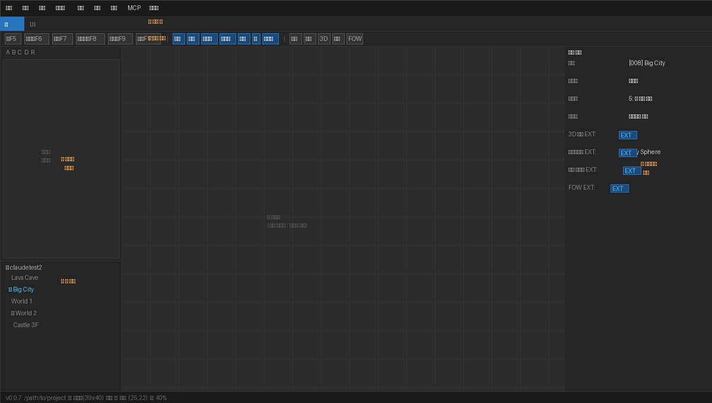
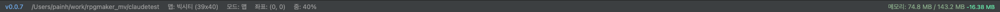

# Editor Overview

## UI Layout

The editor is composed of 5 areas.

| Area | Description |
|------|------|
| ① **Menu Bar** | File, Edit, Mode, Draw, Scale, Tools, Game, MCP, Help |
| ② **Tab Bar** | Switch between **Map** edit tab / **UI** edit tab |
| ③ **Toolbar** | Edit mode · Draw tools · 3D/FOW toggles · Database button |
| ④ **Sidebar** | Tileset palette (top) + Map tree (bottom) |
| ⑤ **Map Canvas** | Tile drawing / event editing area |
| ⑥ **Inspector** | Property editing for selected map/event/object |

---

## Menu Bar

### File
| Item | Shortcut | Description |
|------|--------|------|
| Open Project | — | Select RPG Maker MV project folder |
| Save | `Ctrl+S` | Save current map |
| New Project | — | Create a new project |
| Deploy | — | Create deployment package (including GitHub Pages) |

### Edit
| Item | Shortcut | Description |
|------|--------|------|
| Undo | `Ctrl+Z` | Undo last action |
| Redo | `Ctrl+Y` | Redo undone action |
| Cut | `Ctrl+X` | Cut selected area |
| Copy | `Ctrl+C` | Copy selected area |
| Paste | `Ctrl+V` | Paste from clipboard |
| Find | `Ctrl+F` | Search events |

### Tools
| Item | Description |
|------|------|
| Database | Edit DB (actors/skills/items etc.) |
| Plugin Manager | Enable/disable/reorder plugins |
| Sound Test | BGM/SE playback test |
| Resource Manager | Manage image/audio files |
| Event Search | Search events by command/text |

### Game
| Item | Shortcut | Description |
|------|--------|------|
| Playtest | — | Run game from current map |
| Test from Current Map | Top-right button | Start directly from current map position |

### MCP
Integration with Claude AI to automatically generate or modify events. Activated when the MCP server is running.

---

## Toolbar

### Edit Modes (left button group)

| Button | Shortcut | Description |
|------|--------|------|
| Map | `F5` | Tile drawing mode |
| Event | `F6` | Event placement/editing mode |
| Lighting | `F7` | Lighting marker placement mode (EXT) |
| Object | `F8` | Image/tile object placement mode (EXT) |
| Camera | `F9` | Camera zone editing mode (EXT) |
| Passage | `F11` | Tile passability editing mode |

### Draw Tools

| Tool | Shortcut | Description |
|------|--------|------|
| Select | `M` | Area selection (copy/move) |
| Pencil | `P` | Draw one tile at a time |
| Eraser | `E` | Delete tiles |
| Fill | — | Replace all matching tiles |
| Rectangle | — | Draw rectangular area |
| Ellipse | — | Draw elliptical area |
| Flood Fill | — | Fill closed area |

### Display Options

| Button | Description |
|------|------|
| Grid | Show/hide tile grid lines |
| Region | Show/hide region layer (z=5) |
| **3D** | Toggle 3D rendering mode **(EXT)** |
| Lighting | Show/hide lighting markers |
| **FOW** | Fog of War settings **(EXT)** |
| Zoom Out/In | Adjust canvas zoom |

---

## Inspector Panel

The right-side inspector displays the current map's properties.

### General Settings
- **Name** / **Display Name** — Map filename and in-game display name
- **Tileset** — Select tileset to use
- **Scroll Type** — No loop / Horizontal loop / Vertical loop / Both-direction loop
- **Battle Background** — Background 1/2 images
- **BGM/BGS Auto-play**

### Extended Settings (EXT)

> Items marked with `EXT` are stored separately in `Map*_ext.json` for compatibility with the original RPG Maker MV.

| Item | Description |
|------|------|
| **3D Mode** | Play this map in 3D mode |
| **3D Tile Layer** | Represent upper tiles as height in 3D |
| **Lighting System** | Enable lighting effects |
| **Background** | Parallax (2D background) or Sky Sphere (3D skybox) |
| **Animated Tile Editor** | Adjust animation speed for water/waterfall tiles |

---

## Status Bar

Displays the current status at the bottom of the screen.

---

## Keyboard Shortcuts

| Key | Function |
|----|------|
| `Ctrl+S` | Save |
| `Ctrl+Z` / `Ctrl+Y` | Undo / Redo |
| `F5`~`F9`, `F11` | Switch edit mode |
| `M` / `P` / `E` | Select / Pencil / Eraser |
| `+` / `-` | Zoom in / Zoom out |
| `Mouse Wheel` | Adjust zoom |
| `Right-click` drag | Pan map canvas |
| `Double-click event` | Open event editor |
