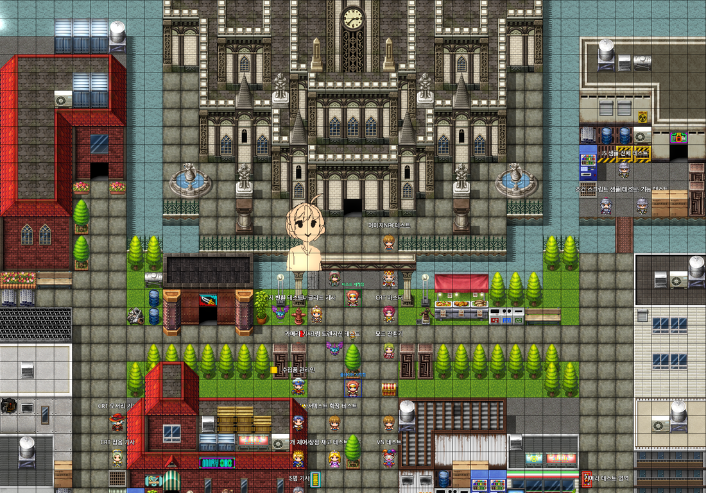
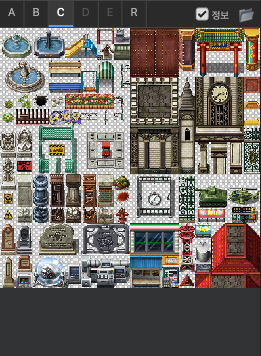
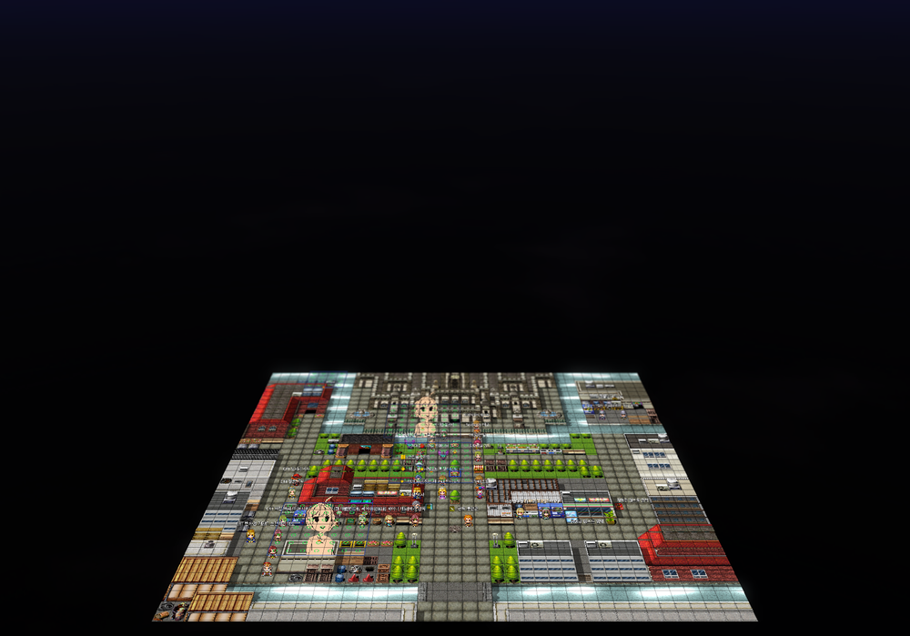

# Map Editor

## Map Canvas

The map canvas is the heart of the editor. You can draw tiles selected from the tile palette onto the canvas, or place and edit events.

---

## Sidebar

### Tileset Palette

The tileset palette is at the top of the sidebar.

**Tab layout**:
- `A` — A1~A5 autotiles (water, terrain, building exteriors, walls)
- `B` — B tileset
- `C` — C tileset
- `D` — D tileset
- `R` — Region layer (Region ID 1~255)

Click a tile in the palette to select it; drag to select multiple tiles at once.

### Map Tree

The map tree is at the bottom of the sidebar.
- **Double-click** a map to open it.
- **Right-click** a map to show the add/delete/properties menu.
- Drag maps to change the hierarchy.

---

## Edit Modes

### Map Edit Mode (`F5`)

Mode for drawing tiles. Select a draw tool from the top toolbar.

**Layer selection**:

**Draw tools**:

| Tool | Action |
|------|------|
| Pencil (P) | Draw one tile at a time by clicking/dragging |
| Select (M) | Drag to select area → Copy (Ctrl+C)/move |
| Eraser (E) | Delete tiles by clicking/dragging |
| Fill | Replace all matching tiles from the clicked position |
| Rectangle | Draw a rectangular area by dragging |
| Ellipse | Draw an elliptical area by dragging |
| Flood Fill | Fill the inside of a closed area |

**Tile info tooltip**: Hover over the map to display layer-by-layer information for that tile.

### Event Edit Mode (`F6`)

Mode for placing and editing events.

- **Double-click empty tile** — Create new event
- **Double-click event** — Open event editor
- **Right-click event** — Copy/paste/delete menu
- **Drag event** — Move position

Events display their ID and character sprite (if any) on top.

### Passability Edit Mode (`F11`)

Edit passability (whether movement is allowed) per tile.

- ○ — Passable
- × — Impassable
- ↑↓←→ — Directional passability

---

## Lighting System (EXT)

> The **Lighting System** checkbox must be enabled in the map inspector.

### Lighting Mode (`F7`)

Place and edit lighting markers on the map.

**Light types**:
- **Point Light** — Emits light in all directions from a specific position
- **Ambient Light** — Base brightness for the entire map
- **Spot Light** — Directional lighting

**Lighting markers**: Displayed as light-shaped markers in edit mode.

**Edit in inspector**:
- Color (RGB)
- Intensity
- Range
- Attenuation mode

Lava Cave example — lighting effect:

---

## Object System (EXT)

A system for freely placing image/tile objects on the map.

### Object Mode (`F8`)

Select or create objects from the object list on the left.

**Object types**:
- **Tile object** — Place tiles selected from the tileset (integer scale sizes)
- **Outline object** — Specify a tile area range on the map
- **Image object** — Place image files directly (arbitrary size/position)
- **Animation object** — Play database animations

**Object properties** (inspector):
- Position (X, Y, Z)
- Size (width in N tiles)
- Height (Z-axis) offset
- Render layer order

---

## Camera Zones (EXT)

Camera zones allow the camera position and angle to automatically change when entering specific map areas.

### Camera Mode (`F9`)

- Drag on the canvas to create a camera zone area
- Click an area to select it, then edit settings in the inspector

**Camera zone settings**:
- **Target Position** — Center point the camera looks at
- **Camera Offset** — Camera position adjustment
- **Zoom** — Zoom factor
- **Easing** — Transition animation style

---

## FOW (Fog of War) (EXT)

Set fog effects using the **FOW** button in the toolbar.

**FOW settings** (inspector):
- **Enable** — Toggle FOW on/off
- **Vision Radius** — Explorable range (in tiles)
- **Fog Color** — Color of unexplored areas
- **Fog Opacity**
- **Show in Editor** — Preview FOW on the editor canvas

---

## Map Properties

Right-click a map in the map tree → **Properties**, or open the map and edit directly in the inspector.

**Configurable items**:
- Name / Display Name
- Map size (width × height in tiles)
- Tileset
- Scroll type (loop options)
- Battle background
- BGM/BGS auto-play
- **3D Mode** (EXT)
- **Skybox** (EXT)
- **Lighting System** (EXT)
- **FOW** (EXT)
- Note

---

## Animated Tile Editor (EXT)

Adjust animation settings for water/waterfall autotiles in the **Animated Tile Editor** section at the bottom of the inspector.

- **Water A (Meadow)** — Meadow water animation
- **Water B (Snow)** — Snow water animation
- **Waterfall** — Waterfall animation
- **Canal** — Canal animation

Set the **speed** (frames/tick) and whether a **shader** is applied for each tile.
