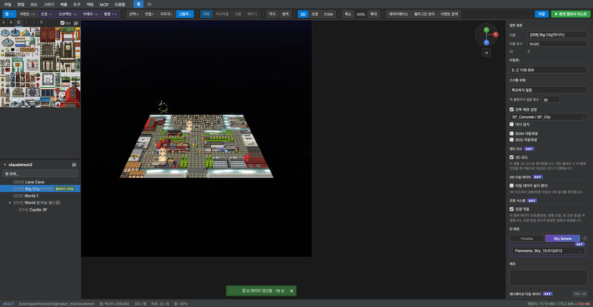
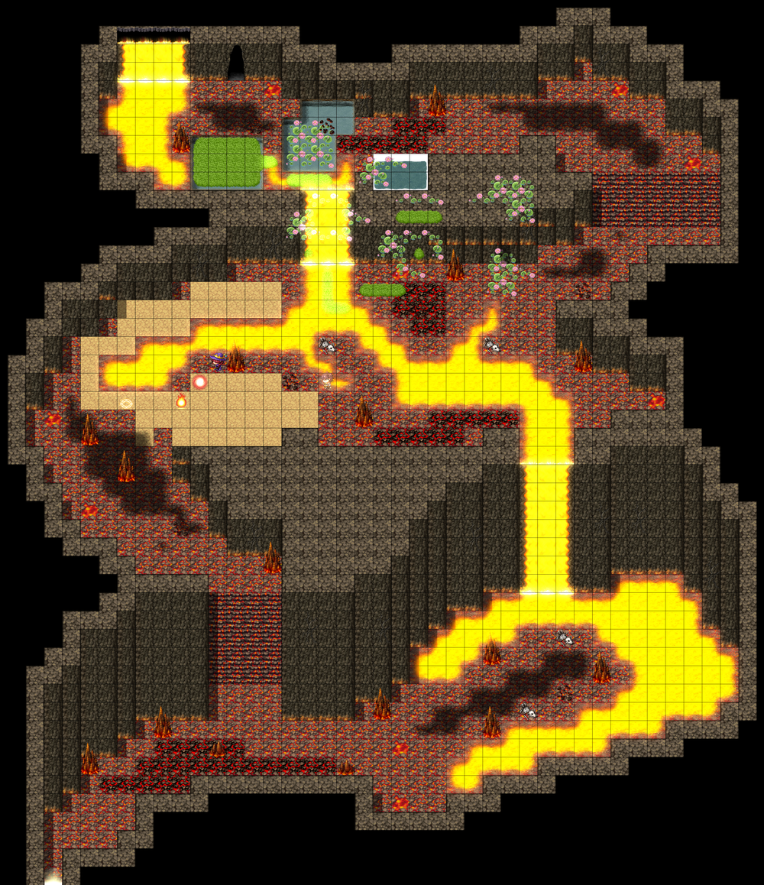

# 3D Mode

## Overview

3D Mode renders RPG Maker MV's 2D maps in an **HD-2D style perspective view**.
It uses the Three.js WebGL renderer and renders existing RPG Maker MV tile/character sprites in 3D space.

---

## How to Enable

### Viewing 3D in the Editor

Click the **3D button** in the toolbar to switch the editor canvas to 3D view.

### Running 3D Mode in-game

Enable the **3D Mode** checkbox in the map inspector to automatically start in 3D mode when playing the map in-game.

> You can also switch between 2D ↔ 3D in-game via event commands or plugin commands at runtime.

---

## 3D Camera Controls

### In the Editor

When 3D mode is enabled, a **gizmo (axis indicator)** appears in the top-right of the map canvas.

| Control | Action |
|------|------|
| Mouse drag | Camera rotation (yaw) |
| Mouse wheel | Zoom in/out |
| Right-click drag | Camera panning |

### In-game

When the [TouchCameraControl plugin](../plugins/touch-camera.md) is enabled:

| Control | Action |
|------|------|
| Touch/drag | Camera yaw rotation |
| Two-finger pinch | Zoom in/out |
| Mouse wheel | Zoom in/out |

---

## 3D Rendering System

### HD-2D Billboard Sprites

In 3D mode, characters and events are rendered as **billboard sprites**. Even as the camera rotates, sprites always face the camera, and the character sprite direction (frame) is automatically corrected based on camera orientation.

### Tile Rendering

- The tilemap is rendered directly on the GPU using Three.js `BufferGeometry`
- Upper layer tiles (z=4) correctly occlude characters (z=3) (roof effect)
- Front-to-back order determined by `renderOrder`

### 3D Tile Layer (EXT)

Enabling the **3D Tile Layer** option in the map inspector reflects the Z-axis height of upper tiles, creating an effect where building rooftops appear actually elevated.

---

## Skybox

In 3D mode, you can set a **panoramic skybox** as the map background.

### Setup

Map inspector → **Background** section:

1. Click the **Sky Sphere** button
2. Select a panorama image file (Equirectangular panorama PNG)
3. Place the image in the `img/skybox/` folder

Supported image format: `img/skybox/filename.png`

For details, see the [SkyBox plugin documentation](../plugins/skybox.md).

---

## Lighting System

In 3D mode, dynamic lighting is rendered in real-time.

- Point light — Light spreading in a circle
- Ambient light — Overall brightness adjustment
- Shadow calculation — Handled by the ShadowAndLight.js plugin

In maps like Lava Cave, orange/yellow point lights create dramatic atmosphere over lava terrain.

For details, see [Map Editor — Lighting System](02-map-editor.md#lighting-system-ext).

---

## Technical Notes

### Three.js Rendering Considerations

3D mode has the following characteristics:

- **depthTest disabled**: All objects have `depthTest: false`, so front-to-back order is determined only by `renderOrder`, not position.z.
- **Y-flip correction**: Mode3D's projection matrix inverts the Y axis (`m[5] = -m[5]`), so overlay objects require CanvasTexture Y-flip correction.
- **Camera yaw sorting**: In 3D mode, `_sortChildren()` sorts using the formula `depth = x*sin(yaw) + y*cos(yaw)` to maintain correct front-to-back order even when the camera rotates.

### Dual Runtime Structure

Two runtimes coexist in the project folder:

| File | Runtime | Purpose |
|------|--------|------|
| `index.html` | PIXI.js | Original RPG Maker MV compatibility |
| `index_3d.html` | Three.js | Editor 3D mode / Playtest |

When opening/playtesting in the original RPG Maker MV Steam version, `index.html` (PIXI) is used.
