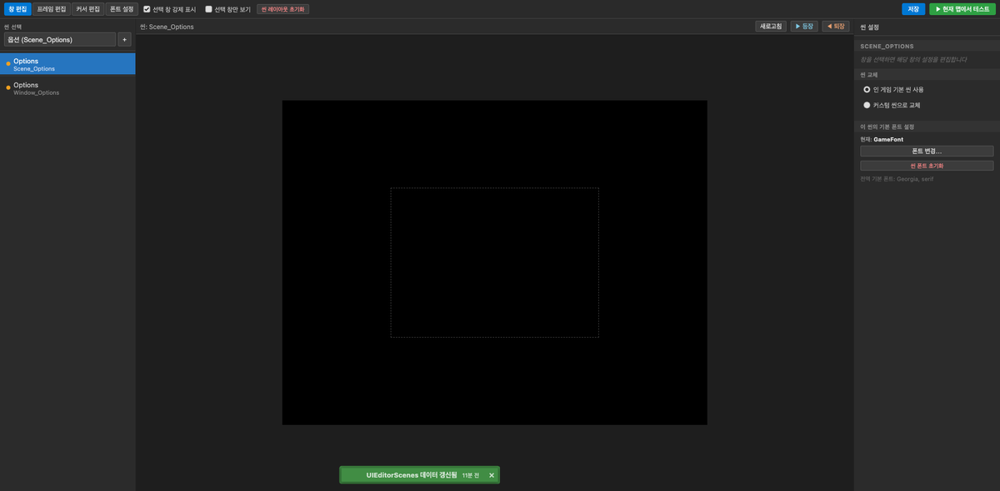
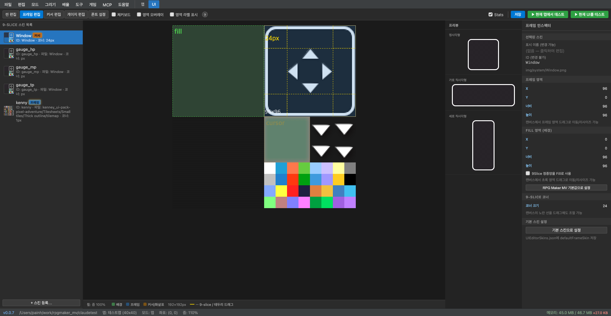
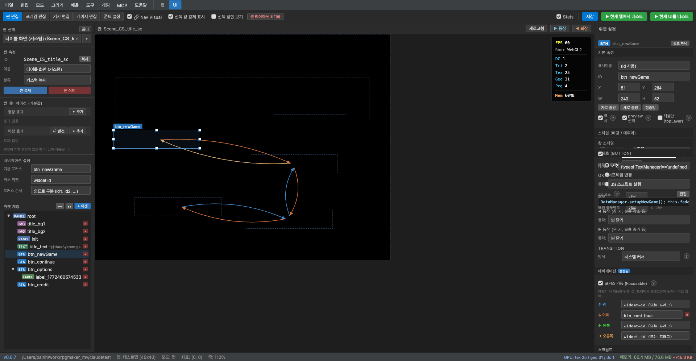

# UI Editor

The UI Editor is a feature for visually editing the game's UI.
Click the **UI** tab in the top tab bar to enter it.

The UI Editor consists of two subsystems:

1. **UITheme** — Window layout · 9-slice skins · font customization
2. **Custom Scene Engine** — Define new in-game UI scenes via JSON

---

## UI Editor Layout



---

## UITheme — Window Skin System

The `UITheme.js` plugin loads `data/UIEditorConfig.json`, `data/UIEditorSkins.json`, and `data/UIEditorFonts.json` to customize the entire game UI.

### Window Edit Tab

Sets the default properties for all game windows.

**Configurable items**:
- Default windowskin image
- Default font size / color / outline
- Background opacity (backOpacity)
- Color tone (colorTone: R/G/B)

### Frame Edit Tab

Visually edit the borders (frames) commonly used in in-game UI windows. Specify the background and border areas from the windowskin image, and set them to stretch naturally to any window size using 9-slice rendering.



- **Left**: Registered skin list — Manage gauges (HP/MP/TP), custom skins, etc. individually
- **Center canvas**: Directly specify frame and background areas by dragging over the windowskin image
- **Right inspector**: Adjust frame area (X/Y/width/height), fill area (background), and corner size numerically
- **Preview**: Check the actual appearance in real-time

### Cursor Edit Tab

Set the image and animation for the selection cursor.

### Font Settings Tab

Define font presets. Different fonts can be applied to each window.

- Font files: TTF/WOFF files in the `fonts/` folder
- Font size
- Outline color/width
- Line height

---

## Custom Scene Engine

The `CustomSceneEngine.js` plugin reads `data/UIScenes/_index.json` + per-scene JSON files to dynamically generate in-game UI scenes.

### Scene Selection and Creation

Select the scene to edit from the **scene selection dropdown** in the top-left.

Use the `+` button to add a new scene.

### Scene Replacement

**Scene replacement** options in the inspector:
- **Use in-game default scene** — Use the original RPG Maker MV scene
- **Replace with custom scene** — Replace with a scene defined in `data/UIScenes/`

Example: Replacing `Scene_Options` with a custom scene completely replaces the in-game options screen with a new layout.

### Widget Tree (formatVersion 2)

Custom scenes are composed of a widget tree. The scene list on the left shows the hierarchical widget structure.

**Widget types**:

| Widget | Description |
|------|------|
| `Panel` | Layout container (places child widgets) |
| `List` | Selectable command list |
| `Label` | Text display |
| `Image` | Image display |
| `ActorFace` | Actor face image |
| `Gauge` | HP/MP/EXP gauge |
| `Button` | Clickable button |

### Template Variables

Insert dynamic values into text using `{variable}` format:

```
{actor[0].name}    → First party member's name
{actor[0].level}   → First party member's level
{actor[0].hp}      → First party member's HP
{var:10}           → Game variable #10 value
{switch:5}         → Game switch #5 state (true/false)
{gold}             → Party's gold
{config.bgmVolume} → Config value (bgmVolume)
```

### Sample Scene Editing



The editor includes sample scenes for commonly used UIs such as title, options, and status. Instead of building from scratch, simply select a sample scene and modify the button positions, text, backgrounds, etc. to easily create your own UI.

Turn on **Nav Visual** mode to visually check and edit navigation connections between buttons. Blue/orange lines show the path focus moves when directional keys are pressed.

---

### Real-time Testing

Use the **Test from Current Map** button to immediately check the current UI settings in-game.

Use the **Enter** / **Exit** buttons at the top of the scene editor to preview scene transition animations.

---

## UIEditorConfig.json Structure

```json
{
  "windows": [
    {
      "windowClass": "Window_Options",
      "windowStyle": "frame",
      "windowskinName": "MyCustomSkin",
      "x": 100, "y": 50,
      "width": 400, "height": 300,
      "fontSize": 20,
      "backOpacity": 180,
      "colorTone": [0, 0, 30, 0]
    }
  ]
}
```

---

## UIEditorSkins.json Structure

```json
{
  "skins": [
    {
      "name": "MyCustomSkin",
      "windowskin": "Window_Blue",
      "fillArea": { "x": 0, "y": 0, "w": 64, "h": 64 },
      "frameInfo": { "x": 0, "y": 64, "w": 64, "h": 64, "cornerSize": 12 }
    }
  ]
}
```

---

## UIEditorFonts.json Structure

```json
{
  "fonts": [
    {
      "name": "GameFont",
      "face": "dotgothic16",
      "size": 22,
      "outlineColor": "rgba(0,0,0,0.7)",
      "outlineWidth": 3
    }
  ]
}
```
