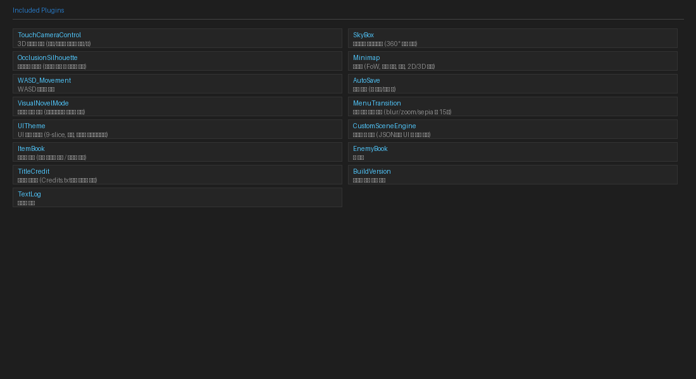

# Built-in Plugin List



A list of plugins included with the editor by default.
They are automatically copied to the `js/plugins/` folder when you open a project.

---

## 3D / Camera

| Plugin | Summary | Docs |
|----------|------|------|
| **TouchCameraControl** | 3D camera rotation/zoom via touch/mouse, automatic HD-2D character direction correction | [→](../plugins/touch-camera.md) |
| **SkyBox** | Three.js sky dome — Equirectangular panoramic sky background | [→](../plugins/skybox.md) |

## UI / Visual

| Plugin | Summary | Docs |
|----------|------|------|
| **UITheme** | Full customization of 9-slice skins · fonts · window layout (JSON-based) | [→](../plugins/ui-theme.md) |
| **CustomSceneEngine** | Dynamically generate in-game UI scenes via JSON | [→](../plugins/custom-scene.md) |
| **MenuTransition** | 15 effects (blur/sepia/zoom etc.) when opening/closing menus | [→](../plugins/menu-transition.md) |
| **VisualNovelMode** | Visual novel style typewriter messages + inline choices | [→](../plugins/visual-novel-mode.md) |
| **OcclusionSilhouette** | Display silhouette for characters hidden behind objects | [→](../plugins/occlusion-silhouette.md) |

## HUD / Information

| Plugin | Summary | Docs |
|----------|------|------|
| **Minimap** | Minimap supporting FoW · region colors · markers (2D/3D) | [→](../plugins/minimap.md) |
| **ItemBook** | Encyclopedia of acquired items/weapons/armor | [→](../plugins/item-book.md) |
| **EnemyBook** | Encyclopedia of encountered enemies | [→](../plugins/enemy-book.md) |
| **NPCNameDisplay** | Display NPC name above their head | — |
| **TextLog** | Message dialogue log viewer | [→](../plugins/text-log.md) |

## Quest

| Plugin | Summary | Docs |
|----------|------|------|
| **QuestSystem** | Manage quest definitions, objectives, and rewards in the database | [→](../plugins/quest.md) |

## Controls / System

| Plugin | Summary | Docs |
|----------|------|------|
| **WASD_Movement** | Map W/A/S/D keys as directional keys, Q/E as PageUp/Down | [→](../plugins/wasd-movement.md) |
| **AutoSave** | Auto-save after map transitions, battle end, or menu close | [→](../plugins/autosave.md) |
| **ShopStock** | Shop stock system | — |
| **TouchDestAnimation** | Touch movement destination animation | — |

## Title / Other

| Plugin | Summary | Docs |
|----------|------|------|
| **TitleCredit** | Add a credits button to the title screen (loads Credits.txt) | [→](../plugins/title-credit.md) |
| **BuildVersion** | Display build number in the bottom-right of the title | — |
| **MessageWindowCustom** | Message window customization | — |

---

## Plugin Management

Manage plugins from the **Tools → Plugin Manager** menu.

- Enable/disable individual plugins with checkboxes
- Drag to change load order (order matters for some plugins)
- Configure plugin parameters

### Recommended Load Order

Recommended order when using 3D mode:

```
1. UITheme
2. CustomSceneEngine
3. TouchCameraControl
4. SkyBox
5. OcclusionSilhouette
6. Minimap
7. AutoSave
8. VisualNovelMode
9. MenuTransition
10. WASD_Movement
... (other plugins)
```
