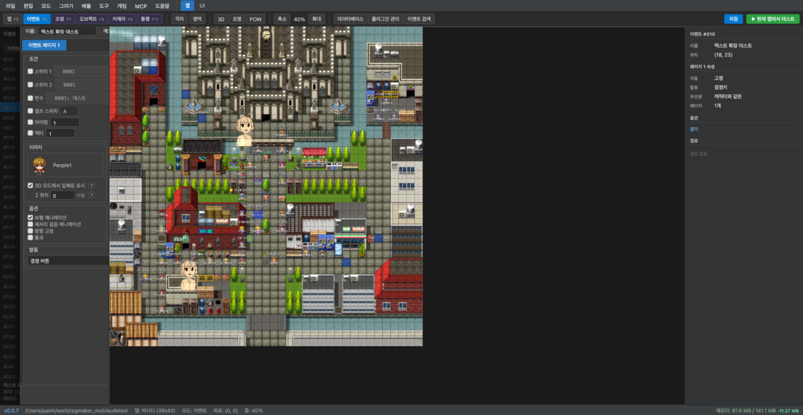
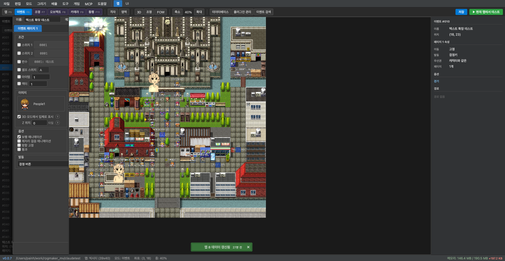
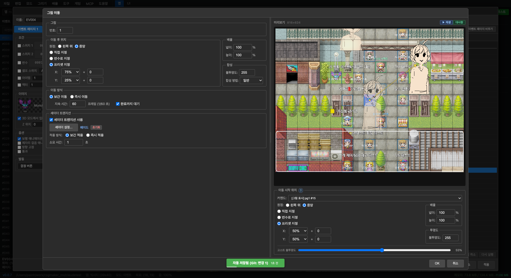
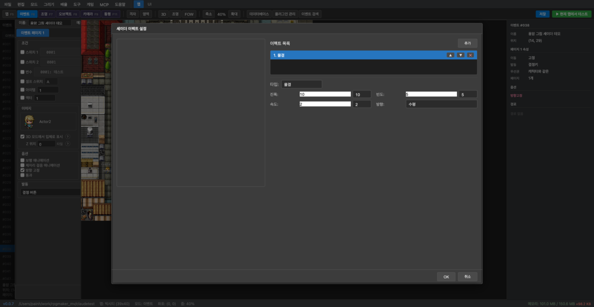
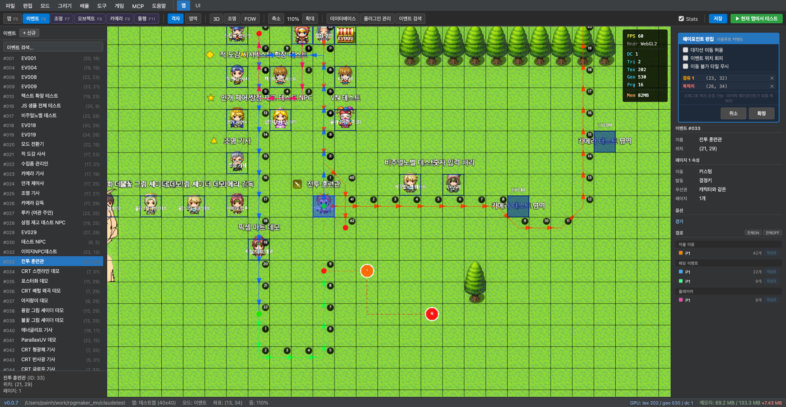
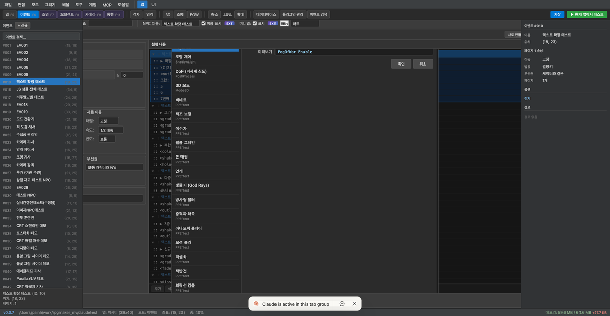
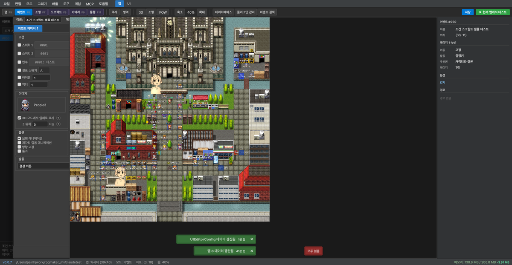
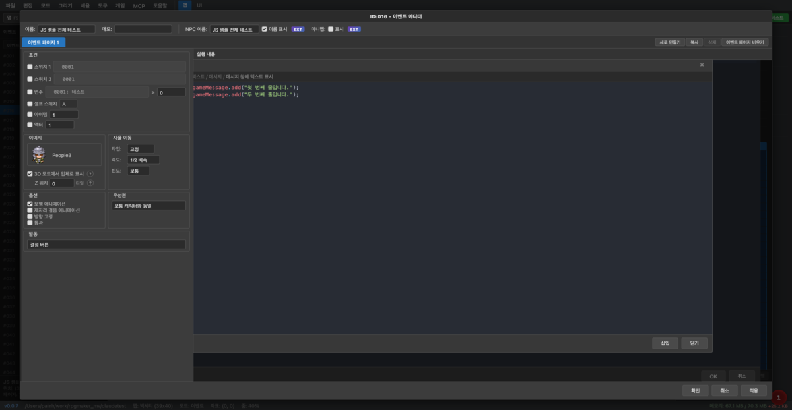
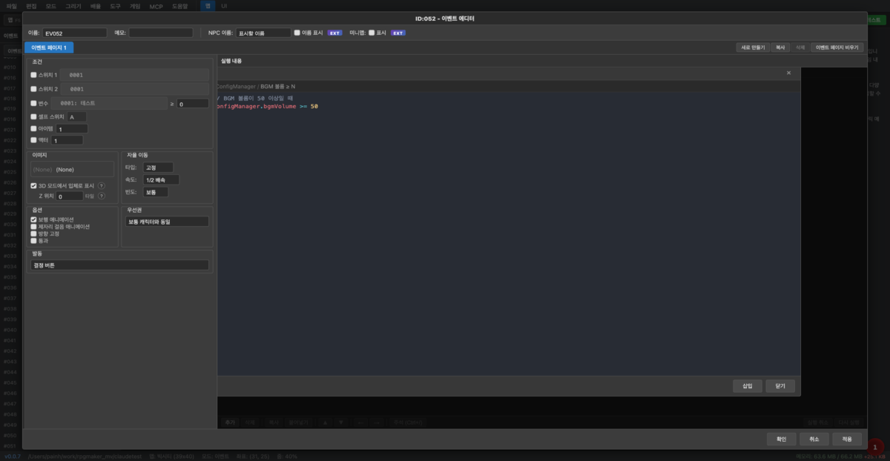

# イベントエディタ

イベントエディタは、マップに配置されたイベントの条件、実行内容、画像、移動方式などを編集します。

## 画面構成

- **左パネル**: イベント名、メモ、NPC 画像、移動設定、オプション、起動条件
- **右パネル**: イベントページリスト + 各ページの実行内容 (コマンドリスト)

## コマンドの挿入

実行内容で**追加**ボタンを押すと、コマンド挿入ダイアログが開きます。

タブ 1〜4 でカテゴリーが分かれており、検索ボックスでのテキスト検索もサポートしています。

---

## 主なコマンド編集ポップアップ

### テキストの表示

顔画像、背景タイプ、位置を指定し、メッセージ本文を入力します。`\V[n]`、`\N[n]` などのテキストコードを使用できます。

---

### 絵の表示

絵の番号、画像ファイル、原点 (左上/中央)、座標、拡大率、不透明度、合成方法を設定します。

#### シェーダーエフェクト (EXT)

**EXT** ボタンを押すと、追加のシェーダーエフェクトを設定できます。ブラー、リップル、色分離などのエフェクトと振幅・周波数・速度・方向を調整します。

---

### 移動ルートの設定

移動ルート設定コマンドは**ウェイポイント**方式と**クラシック**方式の 2 つをサポートしています。

#### ウェイポイントモード

マップキャンバス上で目的地と経由地を直接クリックしてルートを視覚的に設定します。赤い点 (ウェイポイント) と点線が移動経路を示し、A* アルゴリズムが障害物を自動的に回避する最短経路を計算します。

- **編集開始**ボタンを押すと、キャンバスがウェイポイント編集モードに切り替わります。
- マップ上をクリックするとウェイポイントが追加され、経由地間のルートが自動的に接続されます。
- 右インスペクターの**確定**ボタンを押すと、ルートが移動ルートコマンドに変換・保存されます。

#### クラシックモード

オリジナルの RPG Maker MV 方式です。移動コマンドボタン (上/下/左/右、ジャンプ、速度変更など) を順番にクリックしてルートを構成します。

---

### プラグインコマンド

プラグインコマンド名と引数を入力します。エディター同梱プラグインのコマンドはオートコンプリートで選択できます。

---

### スクリプト

#### スクリプトエディタ

JavaScript コードを直接入力します。コードハイライトと複数行編集をサポートしています。

#### サンプル挿入 (テンプレート)

**サンプル挿入**タブをクリックすると、カテゴリー別のコードスニペットリストが開きます。項目を選択すると右側にプレビューが表示され、**挿入**ボタンでエディターに追加します。

カテゴリー: テキスト/メッセージ、変数/スイッチ、移動/位置、キャラクター操作、絵 (Picture)、画面エフェクト、オーディオなど

---

### 条件分岐 — スクリプトタブ

条件分岐ダイアログの**タブ 4 → スクリプト**ラジオを選択すると、JavaScript 条件式を直接入力できます。

- **ラベル**: 条件の意味を簡単にメモ (コマンドリストに表示される)
- **式**: `true`/`false` を返す JavaScript 条件式

#### 条件式テンプレート (`...` ボタン)

式フィールド右側の **`...`** ボタンを押すと、よく使う条件式テンプレートリストが開きます。カテゴリーは ConfigManager、所持金、変数、スイッチ、パーティー/アイテムなどに分かれています。
