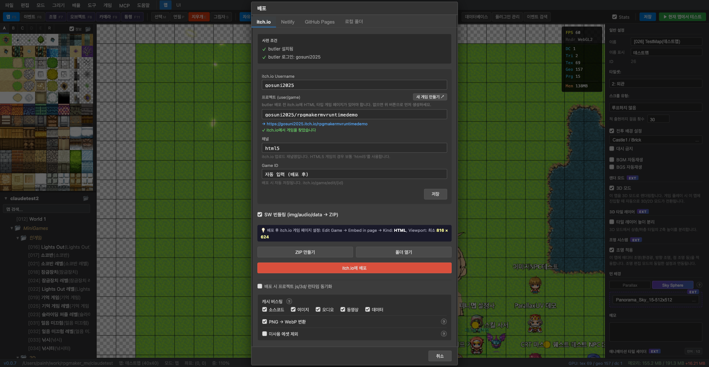

# 配布

ゲームが完成したら、**ファイル → 配布**メニューからさまざまなプラットフォームに配布できます。

## 配布先

| タブ | 説明 |
|------|------|
| **itch.io** | butler CLI で itch.io に直接アップロード |
| **Netlify** | Netlify サイトに配布 |
| **GitHub Pages** | GitHub Pages ブランチに push |
| **ローカルフォルダ** | ZIP またはフォルダとしてエクスポート |

## itch.io への配布

itch.io タブでは butler CLI を通じてゲームを直接アップロードします。

- **前提条件**: butler のインストールとログインが必要
- **Username / プロジェクト**: itch.io アカウントとプロジェクト URL を設定
- **チャンネル**: 配布チャンネル (HTML5 ゲームは `html5`)
- **新規ゲーム作成**: プロジェクトがない場合は itch.io に自動作成

## 配布オプション

### SW バンドリング

画像、音声、データを ZIP にバンドルします。ブラウザが Service Worker でバンドルをキャッシュし、読み込み速度を向上させます。

### キャッシュバスティング

ソースコード、画像、音声、動画、データのカテゴリー別にキャッシュバスティングを選択できます。更新されたリソースがブラウザキャッシュなしで即座に反映されます。

### PNG → WebP 変換

画像を WebP 形式に自動変換してファイルサイズを削減します。

### 未使用アセットの除外

プロジェクトで実際に使用していない画像・音声ファイルを配布から除外し、ファイルサイズを最小化します。
