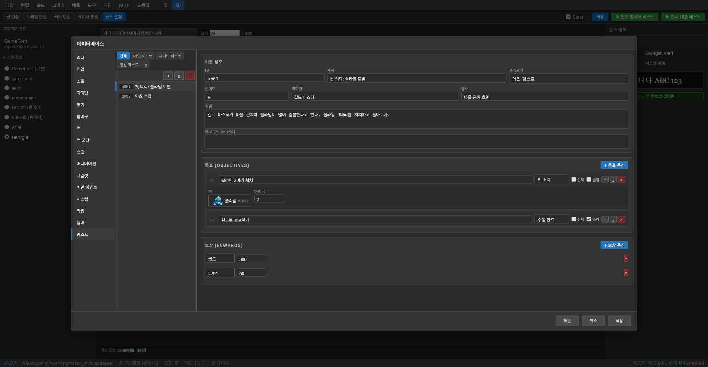

# QuestSystem — 퀘스트 플러그인

퀘스트 플러그인은 게임 내 퀘스트를 데이터베이스에서 직접 정의하고 관리할 수 있는 기능을 제공합니다.

## 퀘스트 설정 화면

데이터베이스의 **퀘스트** 탭에서 퀘스트를 추가·편집합니다.

### 기본 정보

- **ID** — 퀘스트 고유 식별자 (예: `q001`)
- **제목** — 퀘스트 이름
- **카테고리** — 메인 퀘스트, 사이드 퀘스트, 일일 퀘스트 등으로 분류
- **난이도** — 퀘스트 난이도 표시
- **의뢰인 / 장소** — 퀘스트를 주는 NPC와 발생 장소
- **설명** — 퀘스트 내용을 플레이어에게 보여줄 텍스트

### 목표 (Objectives)

퀘스트 완료 조건을 목표 단위로 설정합니다.

- **적 처치** — 특정 적을 지정 수만큼 처치 (예: 슬라임 3마리 처치)
- **수동 완료** — 이벤트에서 직접 완료 처리
- **선택 / 숨김** 옵션으로 선택적 목표나 숨겨진 목표 설정 가능

### 보상 (Rewards)

퀘스트 완료 시 지급할 보상을 설정합니다.

- **골드** — 보상 금액
- **EXP** — 경험치
- 아이템, 무기, 방어구 등 추가 가능
